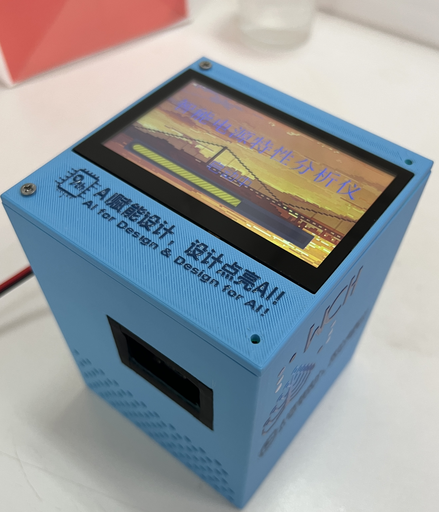
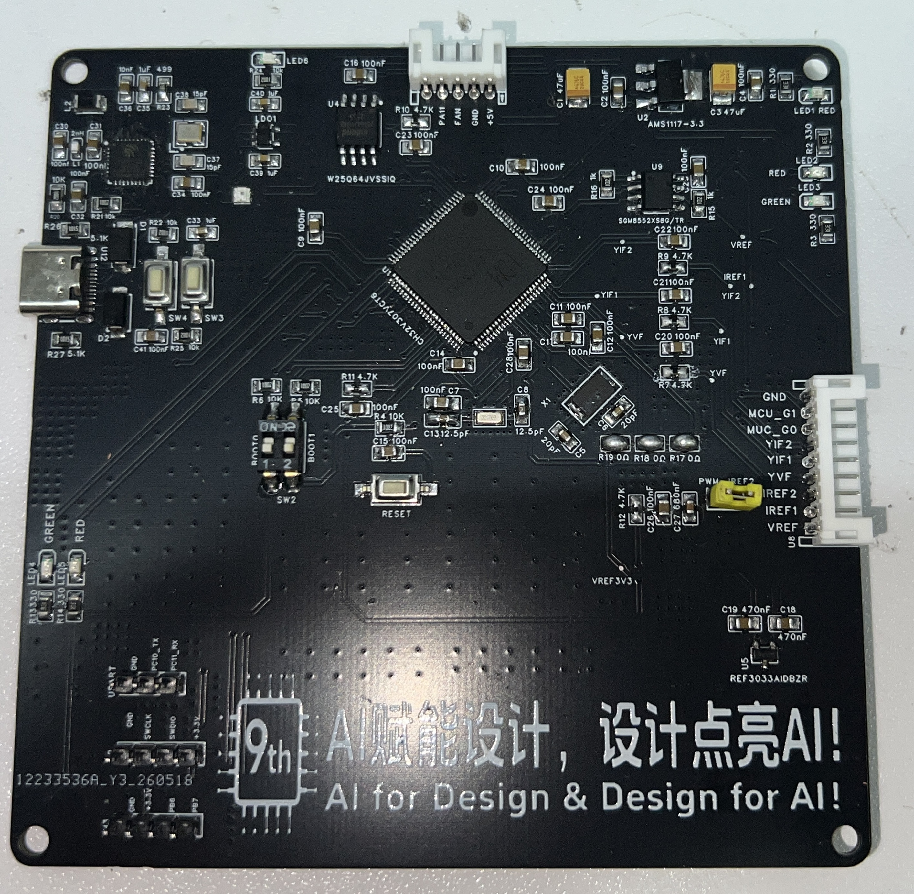
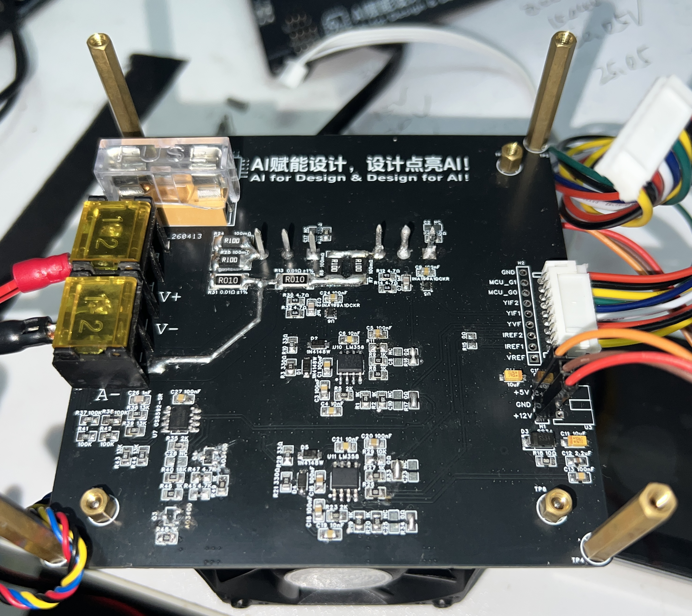
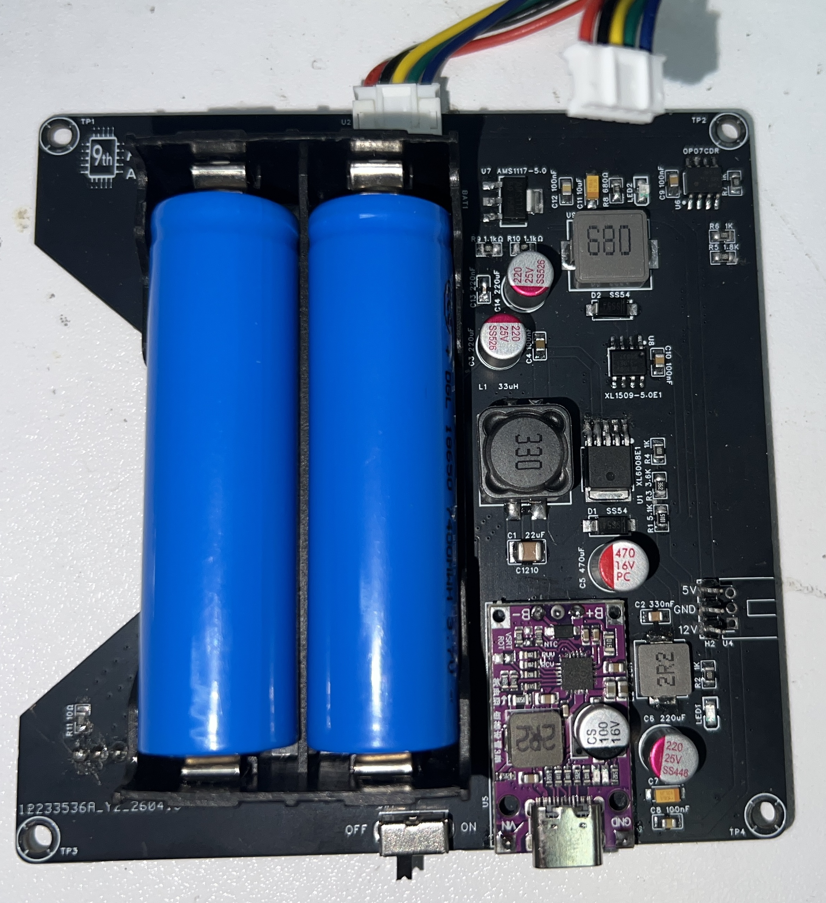
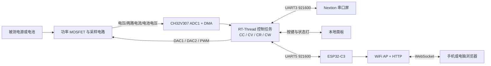

# ESP32-C3 + CH32V307 智能电子负载系统

本仓库保存一套双 MCU 智能电子负载系统：**CH32V307** 负责实时采样、闭环控制和硬件执行，**ESP32-C3** 负责 WiFi 热点、Web 页面、WebSocket 数据广播与远程命令转发。

系统支持恒流（CC）、恒压（CV）、恒阻（CR）、恒功率（CW）、IV 曲线扫描、电池检测、本地串口屏、实体按键以及浏览器无线监控。

## 实物展示

<table>
  <tr>
    <td width="50%" align="center">
      <br>
      <sub>智能电源特性分析仪整机与触摸屏界面</sub>
    </td>
    <td width="50%" align="center">
      <br>
      <sub>CH32V307 主控与信号调理板</sub>
    </td>
  </tr>
  <tr>
    <td width="50%" align="center">
      <br>
      <sub>电子负载功率与采样板</sub>
    </td>
    <td width="50%" align="center">
      <br>
      <sub>双节 18650 电池与多路电源转换板</sub>
    </td>
  </tr>
</table>

## 项目组成

| 子项目 | MCU / 软件平台 | 核心职责 | 详细文档 |
| --- | --- | --- | --- |
| `CH32V307/` | CH32V307VCT6、RT-Thread 4.0.4 | ADC/DMA 采样、PID 与模式控制、DAC/PWM 输出、按键、HMI、风扇和保护逻辑 | [CH32V307 项目说明](CH32V307/README.md) |
| `ESP32/` | ESP32-C3、ESP-IDF | UART 数据中转、WiFi AP、HTTP 页面、WebSocket 广播与网页命令下发 | [ESP32-C3 项目说明](ESP32/README.md) |

两个目录是独立工程，使用不同工具链。修改、编译或烧录时请进入对应目录。

## 系统架构



### 数据流

```text
采样与控制：被测设备 → ADC/DMA → CH32V307 控制算法 → DAC/PWM → 功率级
本地交互：实体按键 / Nextion HMI ↔ CH32V307
无线监控：CH32V307 → UART5 → ESP32-C3 → WebSocket → 浏览器
远程控制：浏览器 → WebSocket → ESP32-C3 → UART5 → CH32V307
```

## 主要功能

### CH32V307 实时控制端

- 四种电子负载模式：CC、CV、CR、CW。
- ADC1 四通道扫描与 DMA 循环采集：负载电压、两路 MOSFET 电流、电池电压。
- DAC1、DAC2 和 TIM4 PWM 生成电压/电流参考。
- CC 模式使用 qpid 位置式 PID；CR/CW 根据实时电压换算目标电流。
- 200 点 IV 曲线扫描，并把采样结果发送至 HMI 和 ESP32-C3。
- 电池开路电压、带载电压、内阻和健康状态检测。
- Nextion 串口屏、三个实体按键、运行灯和负载状态灯。
- 根据功率分档控制四线散热风扇。
- 主线程周期检查 10 A / 200 W 保护条件。
- 基于 RT-Thread 的多线程调度、串口信号量和 FinSH/MSH 控制台。

### ESP32-C3 无线交互端

- 建立独立 WiFi 热点，无需外部路由器。
- 内嵌 HTML/JavaScript 页面，不依赖外部 Web 服务器。
- 通过 UART1 接收 CH32V307 状态 JSON、IV 扫描和电池检测数据。
- 通过 WebSocket 向最多三个浏览器客户端实时广播。
- 把网页侧的模式、数值和启停命令转发给 CH32V307。
- 使用独立 UART 接收任务和 WebSocket 广播任务解耦数据处理。

## 仓库结构

```text
.
├─ README.md                         # 本文：系统总体说明
├─ ESP32/
│  ├─ README.md                      # ESP32-C3 功能、任务和构建说明
│  ├─ CMakeLists.txt                 # ESP-IDF 工程入口
│  ├─ sdkconfig                      # ESP32-C3 工程配置
│  └─ main/
│     ├─ main.c                      # WiFi、HTTP/WebSocket、UART 与 FreeRTOS 任务
│     └─ web.h                       # 内嵌网页
└─ CH32V307/
   ├─ README.md                      # RT-Thread 线程、全部引脚与通信说明
   └─ ELECTRONIC_LOAD/
      ├─ applications/               # 业务线程和控制逻辑
      ├─ board/                      # 板级初始化
      ├─ libcpu/                     # RISC-V CPU 移植层
      ├─ libraries/                  # CH32V307 BSP 与外设库
      ├─ rt-thread/                  # RT-Thread 4.0.4 源码
      ├─ .config / rtconfig.h        # RT-Thread 功能配置
      └─ SConstruct                  # SCons 构建入口
```

## 两块控制器的连接

| ESP32-C3 | CH32V307 | 用途 |
| --- | --- | --- |
| GPIO4 / UART1 TX | PD2 / UART5 RX | 网页控制命令、模式和设定值下发 |
| GPIO5 / UART1 RX | PC12 / UART5 TX | 实时状态、IV 曲线和电池检测数据上传 |
| GND | GND | 通信共地 |

串口参数为 **921600 baud、8 数据位、1 停止位、无校验**。

> 接线时必须交叉连接 TX/RX，并确保两块控制器共地。两侧均为 3.3 V 逻辑电平。

## 通信约定

CH32V307 的 UART3（HMI）和 UART5（ESP32/蓝牙）控制帧采用以下边界：

```text
帧头：0x40
数据：命令与参数
帧尾：0xFF 0xFF 0xFF
```

CH32V307 每 200 ms 向 ESP32-C3 推送一次常规状态，例如：

```json
{"v":1200,"i":150,"p":1800,"m":0,"o":1}
```

- `v`：电压，通常按 ×100 编码。
- `i`：电流，通常按 ×100 编码。
- `p`：功率，通常按 ×100 编码。
- `m`：模式，`0=CC`、`1=CV`、`2=CR`、`3=CW`、`4=菜单`。
- `o`：负载输出状态，`0=关闭`、`1=开启`。

IV 扫描使用开始帧、200 个数据点和结束帧分包传输，避免单帧过大。

## 快速开始

### 1. 构建 CH32V307 固件

推荐使用 RT-Thread Studio 2.2.9、RISC-V GCC 和 WCH-Link。

```sh
cd CH32V307/ELECTRONIC_LOAD
pkgs --update
scons
```

`pkgs --update` 会根据 `.config` 恢复未纳入仓库的 U8g2 和 qpid 软件包。也可以直接在 RT-Thread Studio 中导入 `.project` 后编译、烧录。

### 2. 构建 ESP32-C3 固件

安装 ESP-IDF 环境后执行：

```sh
cd ESP32
idf.py set-target esp32c3
idf.py build
idf.py flash
idf.py monitor
```

### 3. 连接网页

1. 分别烧录 CH32V307 和 ESP32-C3 固件。
2. 按上表连接 UART 与 GND。
3. 手机或电脑连接 WiFi `ELoad-AP`。
4. 浏览器访问 `http://192.168.4.1`。
5. 在网页或本地 HMI 中选择模式、设置目标值并控制负载输出。

开发固件当前 WiFi 密码为 `12345678`。实际部署前建议修改 `ESP32/main/main.c` 中的热点凭据。

## CH32V307 线程概览

应用当前创建 12 个工作线程：

| 类别 | 线程 |
| --- | --- |
| 实时采样与输出 | `ADC`、`ONOFF`、`CWCR` |
| 本地交互 | `KEY`、`HMI_GetDate`、`HMI_Display`、`UART3` |
| 无线/串口通信 | `UART5`、`BlueTooth`、`ESP32Push` |
| 辅助任务 | `FAN`、`SYS_LED` |

各线程的优先级、栈大小、时间片、执行周期和职责见 [CH32V307 线程明细](CH32V307/README.md#实际启用的应用线程)。

## 关键引脚概览

| 功能 | CH32V307 引脚 |
| --- | --- |
| 四路 ADC | PA0：负载电压；PA1/PA2：两路电流；PA3：电池电压 |
| 控制输出 | PA4：DAC1/VREF；PA5：DAC2/IREF1；PB9：TIM4_CH4/IREF2 |
| 风扇 | PC6：TIM8_CH1 PWM |
| HMI | PB10/PB11：USART3 TX/RX |
| ESP32/蓝牙 | PC12/PD2：UART5 TX/RX |
| OLED | PB6/PB7：软件 I²C1 SCL/SDA |
| 按键 | PD10/PD9/PD8：KEY1/KEY2/KEY3 |
| 状态灯 | PD12：系统心跳；PD11：负载状态 |

完整引脚方向、信号名称和代码用途见 [CH32V307 引脚表](CH32V307/README.md#引脚与外设用途)。

## 当前实现说明

- OLED 驱动与线程代码仍保留，但 OLED 显示线程当前已注释停用。
- 独立看门狗初始化函数已经实现，但 `SYS_Init()` 中的调用当前被注释。
- 电压采样量程控制脚 PD14/PD15 当前固定为低电平，以规避原三档切换电路问题。
- UART4 已在 BSP 中启用，当前业务代码未绑定具体协议，可作为备用调试串口。
- `packages/`、`Debug/`、`build/`、固件、对象文件和 IDE 缓存不纳入版本控制，可由工具链重新生成。

## 安全提示

电子负载涉及大电流和功率器件。首次调试时请使用限流电源，从低电压、低电流开始，并确认 MOSFET、采样电阻、散热器、风扇和保护逻辑工作正常。不要仅依赖软件保护代替硬件过流、过温和保险措施。
